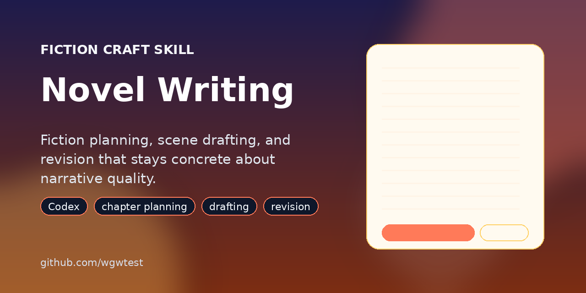

# Novel Writing

[](https://github.com/wgwtest/novel-writing)

[](https://github.com/wgwtest/novel-writing/stargazers)
[](https://github.com/wgwtest/novel-writing/releases)
[](./LICENSE)

A Codex skill for fiction planning, chapter drafting, scene continuation, and revision that stays concrete about narrative problems instead of giving vague workshop-style feedback.

## Why Use It

This skill is meant for longform fiction work where narrative judgment matters.

It helps Codex:

- plan chapters and scenes with actual narrative function
- draft or continue fiction prose without collapsing everything into summary
- review prose with concrete findings instead of soft impressions
- protect style-bearing material during revision
- check whether scenes obey realism and access limits

## Good Fit

Use this repo when the task is mainly about fiction craft:

- chapter or scene planning
- prose continuation
- rewrite while preserving voice
- structural review of a chapter
- character introduction quality
- realism constraints inside a scene

If your main problem is project recovery, chapter-state tracking, or workspace governance across a large novel, use [novel-project-strategy](https://github.com/wgwtest/novel-project-strategy) alongside this skill.

## Example Prompts

- `Use novel-writing. Review this chapter and give concrete findings with locations, not vague feedback.`
- `Plan a chapter that introduces the rival clearly and moves the relationship forward.`
- `Continue this scene without flattening the author's voice or cutting style-bearing detail.`

## Install

Manual install:

```bash
git clone https://github.com/wgwtest/novel-writing.git
mkdir -p ~/.codex/skills
cp -R novel-writing/novel-writing ~/.codex/skills/novel-writing
```

For local development with easy upgrades:

```bash
git clone https://github.com/wgwtest/novel-writing.git
mkdir -p ~/.codex/skills
ln -s "$(pwd)/novel-writing/novel-writing" ~/.codex/skills/novel-writing
```

Restart Codex after installing or updating the skill.

Installer-style inputs:

- repo: `wgwtest/novel-writing`
- path: `novel-writing`

## Repository Layout

- `novel-writing/`: installable skill package
- `README.md`: landing page for humans
- `.github/`: templates for issues and pull requests

The installable skill lives in a subdirectory so the repository root can hold public-facing files without leaking extra repo metadata into the package.

## Related Repos

- [novel-project-strategy](https://github.com/wgwtest/novel-project-strategy): longform fiction workflow, reload order, chapter-state, and sync discipline
- [project-engineering-strategy](https://github.com/wgwtest/project-engineering-strategy): engineering workflow governance for code projects

## Contributing

If you want to improve the skill, start with [CONTRIBUTING.md](./CONTRIBUTING.md). The highest-value contributions are better prompts, cleaner narrative diagnostics, and sharper boundaries around when this skill should or should not fire.

## License

MIT. See [LICENSE](./LICENSE).

## Maintainer Note

This public repository is synced from a separate source-of-truth workspace. Keep the root landing files and the installable package aligned in the same release.
