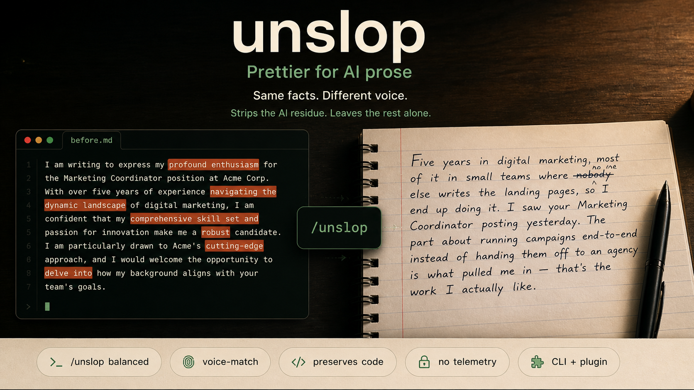
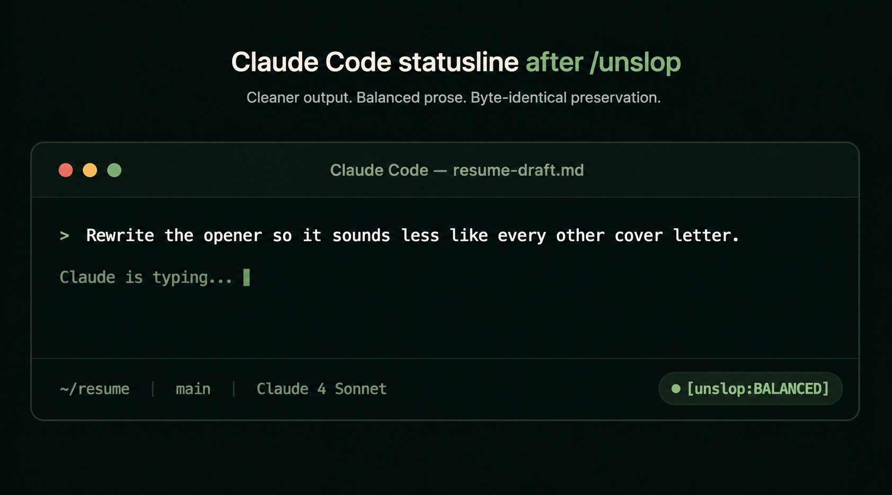
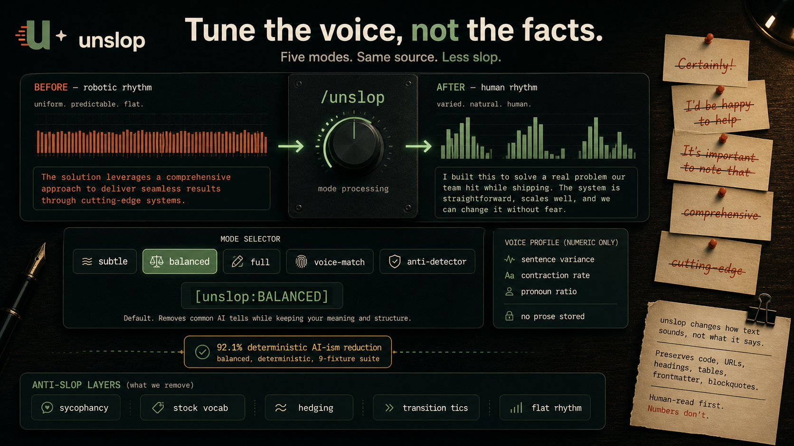
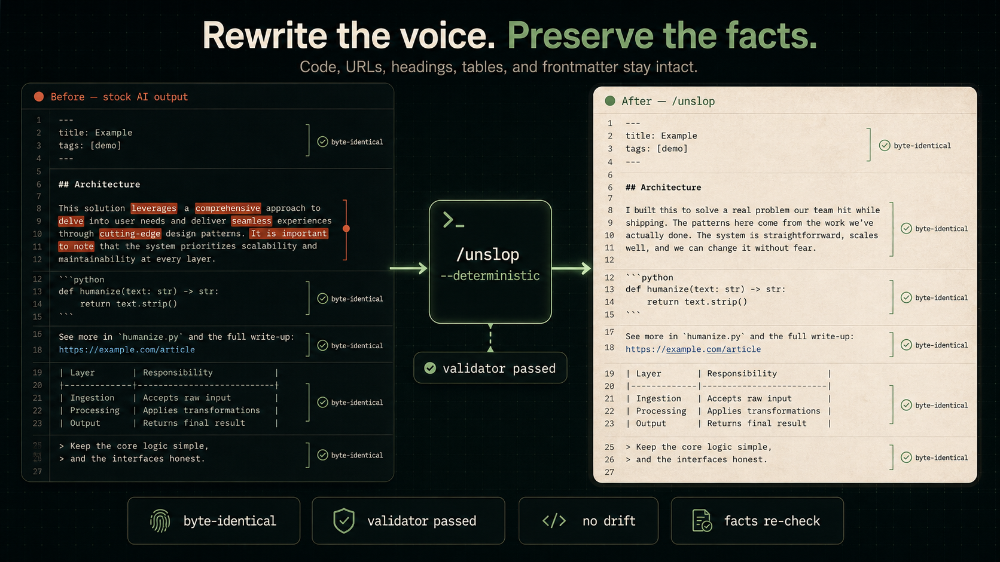
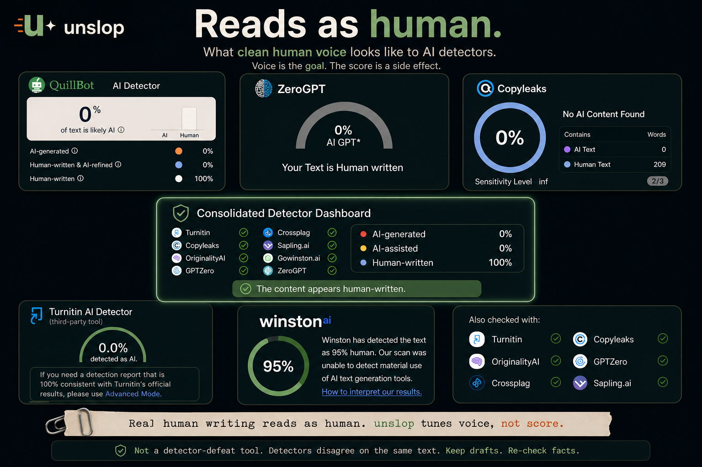
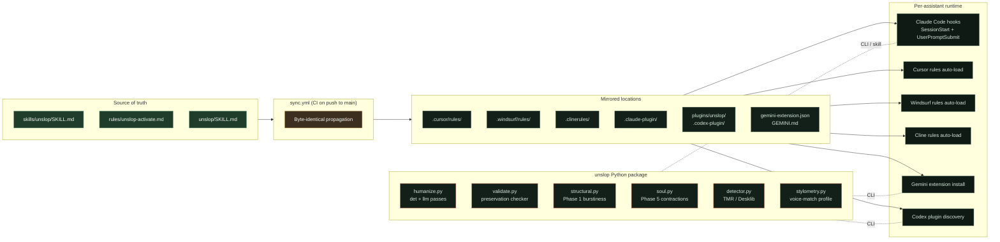

<div align="center">

<a href="#"></a>

<p><i>Claude rewrote my resume and I couldn't send it. The polish was perfect; the voice wasn't mine.<br/>So I built this. It strips the AI residue and leaves the rest alone.</i></p>

</div>

```bash
# Claude Code — paste both lines into any session, restart, type /unslop
/plugin marketplace add MohamedAbdallah-14/unslop
/plugin install unslop
```

<div align="center">

<sub>Cursor, Windsurf, Cline, Gemini CLI, Codex, or the CLI work too. <a href="#60-second-start">Install options →</a></sub>

<br/><br/>

<!-- Jump links -->
<p>
  <a href="#see-the-difference"><b>Demo</b></a> &nbsp;·&nbsp;
  <a href="#60-second-start">Quick start</a> &nbsp;·&nbsp;
  <a href="#what-you-get">Features</a> &nbsp;·&nbsp;
  <a href="#engineering--research">Research</a> &nbsp;·&nbsp;
  <a href="#how-it-stacks-up">Comparison</a> &nbsp;·&nbsp;
  <a href="#faq">FAQ</a> &nbsp;·&nbsp;
  <a href="./GETTING_STARTED.md">Non-technical guide</a>
</p>

<!-- Supported assistants -->
<p>
  
  
  
  
  
  
</p>

<!-- Compact credibility row: 3 signals, not 19 -->
<p>
  <a href="https://github.com/MohamedAbdallah-14/unslop/actions/workflows/ci.yml"></a>
  <a href="https://pypi.org/project/unslop/"></a>
  <a href="./LICENSE"></a>
</p>

</div>

---

## See the difference

Same facts. Different voice. The hero above is the visual; the table below is the readable form.

<table>
<tr><th width="50%">Before (stock AI output)</th><th width="50%">After <code>/unslop</code></th></tr>
<tr>
<td valign="top">

I am writing to express my profound enthusiasm for the Marketing Coordinator position at Acme Corp. With over five years of experience **navigating the dynamic landscape** of digital marketing, I am confident that my **comprehensive skill set and passion for innovation** make me a **robust** candidate. I am particularly drawn to Acme's **cutting-edge** approach, and I would welcome the opportunity to **delve into** how my background aligns with your team's goals.

</td>
<td valign="top">

Five years in digital marketing, most of it in small teams where nobody else writes the landing pages, so I end up doing it. I saw your Marketing Coordinator posting yesterday. The part about running campaigns end-to-end instead of handing them off to an agency is what pulled me in — that's the work I actually like.

</td>
</tr>
</table>

> **21 out of 21** blind LLM-judge runs preferred the unslop rewrite over the original. See [Measured results](#measured-results).

---

## Who actually uses this

Mostly engineers cleaning up agent output before it ships, and people writing things real humans will read — cover letters, essays, LinkedIn posts. If you're the second category, the [non-developer guide](./GETTING_STARTED.md) skips the jargon. If you're the first: it's a CLI plus a hook plus a regex pass.

---

## 60-second start

> [!TIP]
> **Not a developer?** Start with [**GETTING_STARTED.md**](./GETTING_STARTED.md). Plain English, three copy-pasted lines, real cover-letter examples.

### Claude Code plugin (no clone, no install script)

Open any Claude Code session and paste:

```
/plugin marketplace add MohamedAbdallah-14/unslop
/plugin install unslop
```

Restart Claude. Type `/unslop`. Done.

You'll see a `[unslop:BALANCED]` badge appear in the statusline. Everything Claude writes from here on comes out in a human voice. Type `stop unslop` to turn it off, `/unslop full` to turn it up, `/unslop-help` to see everything.

<p align="center">
  
</p>

<details>
<summary><b>Using Cursor, Windsurf, Cline, Gemini CLI, Codex, or just the CLI? Click here.</b></summary>

<br/>

### Cursor, Windsurf, or Cline

```bash
git clone https://github.com/MohamedAbdallah-14/unslop.git
```

Open the folder in your IDE. The bundled rule files at `.cursor/rules/unslop.mdc`, `.windsurf/rules/unslop.md`, and `.clinerules/unslop.md` load automatically. Type `/unslop` in the chat panel.

### Gemini CLI

```bash
git clone https://github.com/MohamedAbdallah-14/unslop.git && cd unslop
gemini extension install ./
```

Reads `gemini-extension.json` and loads `GEMINI.md` + the unslop skill into context.

### OpenAI Codex

Clone the repo — the `plugins/unslop/.codex-plugin/plugin.json` bundle is auto-discovered by the Codex IDE extension.

### Claude Code without the plugin system (manual hooks)

For forks, air-gapped setups, or when you want to see exactly which files get written:

```bash
git clone https://github.com/MohamedAbdallah-14/unslop.git
cd unslop
bash hooks/install.sh            # macOS / Linux
pwsh hooks/install.ps1           # Windows
```

What this does:

- Copies hook scripts to `~/.claude/hooks/` (flat, not a subdirectory)
- Registers `SessionStart` and `UserPromptSubmit` in `~/.claude/settings.json`, merged safely via Node (never clobbers existing hooks)
- Wires the statusline so `[unslop:FULL]` shows when active

Idempotent. Re-run anytime to upgrade. The bash installer re-verifies `settings.json` state on each run; the PowerShell installer checks file presence only, so pass `-Force` on Windows if `settings.json` was hand-edited.

### Standalone CLI (no IDE needed)

```bash
pip install unslop
unslop --deterministic path/to/file.md
```

Two modes: `--deterministic` (regex, no API) or default LLM mode (calls Claude). See [`unslop/README.md`](./unslop/README.md) for the full CLI surface.

</details>

---

## Measured results

Blind LLM-as-judge preference test. Claude Sonnet 4.5 compares each unslop rewrite against the original without knowing which is which. Seven fixtures, randomized A/B sides, 3 independent runs per fixture = 21 judgments.

<div align="center">

| Metric                                 | Baseline | unslop (balanced, 3-run) |
| :------------------------------------- | :------: | :----------------------: |
| Blind humanness preference             |    —     | **100 % (21/21)**        |
| Humanized wins / ties / original wins  |    —     | **21 / 0 / 0**           |
| AI-ism reduction (rule-counted)        |   0 %    | **92.1 %** (9-fixture suite, 2026-04-28) |
| Flat-paragraph count across suite      |    14    | 13                       |
| Preservation of code / URLs / headings |    —     | **byte-identical**       |

</div>

Every fixture wins 3/3 runs. Reproduce with `python3 evals/perceived_humanness.py --runs 3` (needs `ANTHROPIC_API_KEY`). Archived at `benchmarks/results/humanness/three-run-post-soul-fix-20260421.json`.

> [!NOTE]
> Humanness preference is measured by an LLM judge. Detector-score resistance is a different problem entirely. See [How it stacks up](#how-it-stacks-up) and [When it actually matters](#when-it-actually-matters-the-honest-version). Two different jobs; unslop is honest about both.

---

## What you get

<table>
<tr>
<td width="33%" valign="top">

### Five modes

`subtle` keeps the shape, scrubs the fingerprints. `balanced` is the default. `full` rewrites with opinion. `voice-match` mimics a sample. `anti-detector` does the burstiness and specificity moves that move GPTZero scores.

</td>
<td width="33%" valign="top">

### Preservation that actually holds

Code blocks, inline code, URLs, headings, YAML frontmatter, tables, blockquotes — byte-identical on the way out. Deterministic mode fails the run if anything drifts. LLM mode gets the same preservation list as an explicit instruction.

Also catches the newer tells: curly quotes, knowledge-cutoff disclaimers, vague attributions, title-case headings, repeated `- **Label:**` bullet stacks.

</td>
<td width="33%" valign="top">

### Six assistants, one source

Claude Code, Cursor, Windsurf, Cline, Gemini CLI, OpenAI Codex. The same skill loads in each one through whichever loading mechanism the platform supports. Single source of truth, synced by CI.

</td>
</tr>
<tr>
<td width="33%" valign="top">

### Real detector feedback

Opt-in CLI flag scores text against the TMR detector (99.28 % AUROC on RAID, 125 M RoBERTa), escalates through the mode ladder, prints what it tried.

</td>
<td width="33%" valign="top">

### Persistent voice-match

Save a numeric profile from a sample of your own writing — sentence-length variance, contraction rate, pronoun ratios. Reuse across sessions. No text samples are stored, so the tool can't learn to flatter you over time.

</td>
<td width="33%" valign="top">

### Pairs with Custom Styles

Anthropic Custom Styles sets the ceiling at generation; unslop catches residue afterwards. The ICLR 2026 Antislop paper formalizes that split.

</td>
</tr>
</table>

<details>
<summary><b>Power-user features</b> — surprisal reading, reasoning-trace sanitizer, mode gating</summary>

<br/>

<table>
<tr>
<td width="33%" valign="top">

### Surprisal-variance reading

`--surprisal-variance` returns the DivEye signal — per-token log-probabilities from a local `distilgpt2`. Flat AI prose lands near 0.6–0.9; literary human prose often exceeds 1.5.

</td>
<td width="33%" valign="top">

### Reasoning-trace sanitizer

Strip `<thinking>` / `<analysis>` / `<reasoning>` / `<scratchpad>` wrappers and `## Plan` sections from agent output before it ships. Opt-in. Sidecar file preserves the original trace.

</td>
<td width="33%" valign="top">

### Mode gating

`--no-structural`, `--no-soul`, and `--no-audit` turn off the newer aggressive passes for highly formal content (legal, compliance). Per-file opt-outs via HTML comments.

</td>
</tr>
</table>

</details>

---

## In the wild

<p align="center">
  
</p>

The badge is the only UI. Everything else is silent — the hook fires on `SessionStart`, injects the activation rule into Claude's context, and tracks the mode in `$CLAUDE_CONFIG_DIR/.unslop-active` (fallback: `~/.claude/.unslop-active`). No network calls. No telemetry.

---

## Using it

<p align="center">
  
</p>

### Toggle modes mid-conversation

<div align="center">

| Phrase                           | Effect                   |
| :------------------------------- | :----------------------- |
| `/unslop`                        | Turn on (balanced)       |
| `/unslop subtle`                 | Light touch              |
| `/unslop balanced`               | Default                  |
| `/unslop full`                   | Strong rewrite           |
| `/unslop voice-match`            | Mimic a provided sample  |
| `/unslop anti-detector`          | Adversarial paraphrase   |
| `stop unslop` &nbsp;·&nbsp; `normal mode` | Off                      |

</div>

Mode persists for the whole session.

### Sub-skills

| Skill                 | Trigger                      | What it does                                                   |
| --------------------- | ---------------------------- | -------------------------------------------------------------- |
| `unslop`              | `/unslop`                    | Active humanization for live responses                         |
| `unslop-commit`       | `/unslop-commit`             | Conventional Commits in human voice                            |
| `unslop-review`       | `/unslop-review`             | Direct, kind PR review comments                                |
| `unslop-file`         | `/unslop-file <file>`        | Rewrite a markdown file (preserves code, URLs, headings)       |
| `unslop-reasoning`    | `/unslop-reasoning`          | Strip AI slop from chain-of-thought (over-hedging, loops)      |
| `unslop-help`         | `/unslop-help`               | Reference card                                                 |

### Voice-match (persist your style)

```bash
unslop --save-voice-profile samples/my-writing.md   # one-time
unslop --voice-memory --mode full document.md       # uses saved profile
unslop --clear-voice-profile                        # delete
```

Storage: `$UNSLOP_STYLE_MEMORY` → `$XDG_CONFIG_HOME/unslop/style-memory.json` → `~/.config/unslop/style-memory.json`. File is mode-`0600`; symlinks refused. Profile is numeric metrics only — no prose stored.

### Strip reasoning traces (agent output)

Agent output often carries private reasoning wrappers (`<thinking>`, `<think>`, `<analysis>`, `<reasoning>`, `<scratchpad>`, `<plan>`) or markdown sections labelled `## Reasoning` / `## Thought Process` / `## Plan`. Ship these into a final doc and you leak a process artifact the reader never wanted.

```bash
unslop --deterministic --strip-reasoning agent-output.md
```

On a file, stripped content is written to `agent-output.reasoning.md` next to the target. On stdin, the sidecar is discarded. The sidecar is gitignored by default because reasoning traces can contain process notes you did not mean to ship. Opt-in; default off.

### Surprisal-variance reading

```bash
cat sample.md | unslop --surprisal-variance
# { "path": "<stdin>", "mean_log_prob": -2.83, "surprisal_stdev": 1.74,
#   "surprisal_cv": 0.61, "token_count": 412, "model": "distilgpt2" }
```

First call downloads `distilgpt2` (~330 MB) via HuggingFace; subsequent calls are ~1 s on CPU. Override with `--surprisal-model gpt2-medium` for a stronger but slower reading. Source: Ganapathi et al., DivEye (arXiv 2509.18880, TMLR 2026). Requires `pip install torch transformers`. Set `UNSLOP_SKIP_SURPRISAL=1` to disable.

### Configure default mode

```bash
export UNSLOP_DEFAULT_MODE=full
```

Or `~/.config/unslop/config.json`:

```json
{ "defaultMode": "full" }
```

Resolution: env var > config file > `balanced`. Set to `"off"` to disable session-start activation entirely.

### Live detector feedback loop

```bash
python3 -m unslop.scripts.fetch_detectors   # one-time: ~500MB of weights
unslop --detector-feedback file.md          # humanize, score, escalate, report
```

Escalation ladder: `balanced` → `full` → `full + structural + soul`. Reports the score at each step. It does not claim to lower scores — it just tells you where you are.

Use `--detector-loop-aggressive` for the longer five-step ladder:

```bash
unslop --detector-feedback --detector-loop-aggressive file.md
```

---

## How it stacks up

Not every tool in this space solves the same problem. Here's the honest map.

<div align="center">

| &nbsp;                                | unslop                    | Anthropic Custom Styles  | Undetectable.ai / StealthGPT / HIX | Plain LLM prompt             |
| :------------------------------------ | :-----------------------: | :----------------------: | :-------------------------------: | :--------------------------: |
| **Works across 6 AI assistants**      | ✅ one plugin             | 🟡 Claude.ai only        | ❌ web paste-box only             | ✅ anywhere                  |
| **Runs offline (deterministic)**      | ✅ regex mode             | ❌ cloud only            | ❌ cloud only                     | ❌ needs API                 |
| **Preserves code / URLs byte-exact**  | ✅ validated              | 🟡 best-effort           | ❌ often breaks code              | ❌ drifts                    |
| **Blind human-reads-more-human test** | ✅ 100 % (21/21)          | 🟡 not publicly measured | 🟡 vendor-claimed, unverified     | 🟡 varies by prompt          |
| **Honest about detector limits**      | ✅ documents < 0.5 pp     | ✅ doesn't claim defeat  | ❌ "99.8 % undetectable" claims   | —                            |
| **No paste-in-browser round-trip**    | ✅ inline in your editor  | ✅ inline                | ❌ copy-paste workflow            | ✅ inline                    |
| **Open source, MIT**                  | ✅                        | ❌ proprietary           | ❌ proprietary                    | —                            |
| **Free**                              | ✅                        | ✅ on Claude.ai          | ❌ $10–30/mo                      | ✅                           |
| **Voice-match from your own writing** | ✅ numeric profile on disk | 🟡 manual style prompt  | ❌                                | 🟡 via prompt                |

</div>

unslop is a polish layer, not a detector-defeat tool. Commercial SaaS humanizers are a different category and mostly don't beat a second pass through a different model family plus five minutes of manual editing (Chicago Booth 2026 audit: median detector-accuracy drop ~6 points, not the claimed 40+).

---

## Limitations

- Rewriting can degrade statistical watermarks like SynthID or green-list schemes. Side effect, not a feature. If provenance matters, watermark after unslop.
- Detector evasion isn't durable when the verifier has source-generation logs or retrieval access. Use anti-detector mode for false-positive defense, not academic misconduct.
- AI detectors over-flag non-native English. Liang et al. (arXiv 2306.04723) found GPTZero, OriginalityAI, and Crossplag flagged >50 % of TOEFL essays as AI-generated. Keep drafts and process notes when stakes are high.

---

## FAQ

<details>
<summary><b>Does it make the AI stop being useful?</b></summary>

<br/>

No. It changes how the reply sounds, not what it says. Ask for a cover letter, you still get a cover letter. Ask for feedback on your essay, you still get feedback. The facts, the advice, the answer — all there. Just without "Certainly! What a fantastic question!" around them.

</details>

<details>
<summary><b>Will it hide my text from AI detectors like GPTZero or Turnitin?</b></summary>

<br/>

Mostly no, honestly. My own testing against the TMR detector (99.28 % AUROC) shows deterministic surface rewriting moves scores by 0.0–0.2 pp. This matches the Adversarial Paraphrasing paper (NeurIPS 2025) predicting that exact outcome: modern detectors fingerprint on structural signals that synonym-swap rewriting cannot move.

What actually lowers detector scores, in order: (1) paraphrase through a different model family — GPT → Claude → Gemini, (2) burstiness, (3) specificity the model can't fake, (4) contractions and small fragments, (5) breaking predictable structure. Items 2–5 are what `/unslop anti-detector` does. Item 1 is a workflow you orchestrate.

Detectors also have a big false-positive problem. Liang et al. (*Patterns* 2023) found >50 % of TOEFL essays flagged as AI-generated. If a reader is running your work through a detector, document your process and keep drafts.

</details>

<details>
<summary><b>Is it safe for code, legal text, medical advice, or runbooks?</b></summary>

<br/>

Turn it off for those. unslop trades precision for voice. For anything where a reader needs to follow the text exactly — a lease, a drug interaction warning, a deployment runbook — you want the robotic version. unslop is for text where the reader needs to like the text.

Deterministic mode preserves code blocks, URLs, headings, tables, blockquotes, and YAML frontmatter byte-identical. The risk isn't the tool breaking code; it's the rewriter smoothing a number you misremembered and making the wrong version sound confident. Re-verify facts after humanizing.

</details>

<details>
<summary><b>Do I need an API key?</b></summary>

<br/>

Not for the default plugin mode (it uses whatever assistant is already loaded — Claude Code, Cursor, etc.). Not for deterministic CLI mode (`--deterministic`, pure regex, no network).

You do need `ANTHROPIC_API_KEY` for: (a) default LLM CLI mode, (b) the `evals/` humanness harness, (c) `/unslop voice-match` and `full` modes when running outside an assistant.

</details>

<details>
<summary><b>Does it send my text anywhere?</b></summary>

<br/>

No telemetry, no analytics, no phone-home. The plugin's hook scripts run locally. The CLI calls whichever API you configured (Anthropic, or none with `--deterministic`). The voice-match cache is a numeric-only JSON file on disk at mode `0600`, stored under `$XDG_CONFIG_HOME/unslop/`. No prose is persisted anywhere.

</details>

<details>
<summary><b>How is this different from just prompting "write like a human"?</b></summary>

<br/>

Three differences:

1. It's consistent. A prompt works for one message; the hook activates the rule every session and reinforces it at turns 8/16/24 to beat persona drift (RMTBench / HorizonBench 2026 measure >30 % degradation after 8–12 turns without reinforcement).
2. It's specific. The rule names dozens of patterns to drop (sycophancy openers, stock vocab, hedging stacks, transition tics, significance inflation) and gives structural targets (burstiness CV, sentence-length spread). "Write like a human" relies on the model's guess at what human means.
3. It's measured. The blind LLM-judge test and rule-based AI-ism counter run on every change. The 100 % preference / 92 % reduction numbers come from that harness, not vibes.

</details>

<details>
<summary><b>Why Python + JavaScript + markdown rules?</b></summary>

<br/>

Each layer matches its host: Python for the file rewriter (CLI, HuggingFace integration, test ecosystem), JavaScript for Claude Code hooks (that's what the `SessionStart` / `UserPromptSubmit` APIs accept), markdown rules for every assistant that reads `.cursorrules` / `CLAUDE.md` / `GEMINI.md` / `.windsurfrules`. The `sync.yml` workflow keeps a single source of truth mirrored to every platform-specific location.

</details>

<details>
<summary><b>Why is it called unslop?</b></summary>

<br/>

"Slop" is the term the LLM-evaluation community converged on for the residue of RLHF preference training — tricolons, sycophancy, stock vocab, tidy five-paragraph shapes. The verb "unslop" is the operation. Name was taken.

</details>

---

## Docs

- **[GETTING_STARTED.md](./GETTING_STARTED.md)** — plain-English on-ramp for non-developers (cover letters, essays, LinkedIn posts).
- **[unslop/README.md](./unslop/README.md)** — the Python package and standalone CLI.
- **[docs/RESEARCH_AND_TECH.md](./docs/RESEARCH_AND_TECH.md)** — public reference: the research that informs shipping code, the tech stack, and the design choices that make unslop different.
- **[docs/research/](./docs/research/)** — 20 research categories, 120+ angle files, full [implementation trace](./docs/research/IMPLEMENTATION_TRACE.md) mapping each finding to the line of code it motivates.
- **[CHANGELOG.md](./CHANGELOG.md)** — all releases.
- **[CONTRIBUTING.md](./CONTRIBUTING.md)** — PR workflow, test gates, SSOT layout.
- **[SECURITY.md](./SECURITY.md)** — vulnerability reporting.
- **[CODE_OF_CONDUCT.md](./CODE_OF_CONDUCT.md)** — community guidelines.

---

<details>
<summary><h2>What stays exact</h2></summary>

<p align="center">
  
</p>

The file-rewriter (`unslop`) placeholder-protects these in deterministic mode and fails the run if the validator detects they changed:

- Fenced code blocks (` ``` ... ``` `) — content and structure
- Indented code blocks (4-space)
- Inline code (`` `foo()` ``)
- URLs and markdown links
- Headings (whole line, text and level)
- YAML frontmatter at file start (`---\n...\n---`)
- Blockquotes (`>` lines and multi-line `>` blocks)
- Markdown tables (pipe tables)
- Quoted single-word examples — `"delve"` or `"tapestry"` stays put, because the word is being discussed, not used (use/mention distinction)

File paths, commands, technical terms, version numbers, and error messages stay exact **when they live inside code blocks / inline code / URLs**. Bare prose references to them are not separately protected; deterministic regexes only target prose patterns, so they usually pass through, but review the diff if your file mixes prose with identifiers.

LLM mode (default) receives the same preservation list as an explicit instruction. It cannot be byte-enforced the way deterministic mode is, so run the file through `python3 -m scripts --deterministic` afterwards if you need a hard guarantee.

</details>

<details>
<summary><h2>What it drops</h2></summary>

`det` = handled by deterministic regex mode. `llm` = requires LLM mode (semantic rewrite, not regex).

| Category                     | Examples                                                                                                                          | Mode          |
| ---------------------------- | --------------------------------------------------------------------------------------------------------------------------------- | ------------- |
| Sycophancy openers           | "Great question!", "Certainly!", "I'd be happy to help"                                                                           | det           |
| Stock vocab                  | delve, tapestry, testament, navigate (figurative), embark, journey (figurative), realm, landscape, pivotal, paramount, seamless…  | det           |
| Hedging stacks               | "It's important to note that", "It's worth mentioning", "Generally speaking", "In essence", "At its core"                         | det           |
| Performative balance         | A "however" appended to every claim                                                                                               | det           |
| Transition tics              | "Furthermore,", "Moreover,", "Additionally,", "In conclusion,", "To summarize," at start of a sentence                            | det           |
| Em-dash pileups              | More than two em-dashes per paragraph (bullet lists get a per-item budget)                                                        | det           |
| Significance inflation       | "marks a pivotal moment", "stands as a testament", "enduring legacy", "leaves an indelible mark"                                  | det           |
| Notability namedropping      | "maintains an active social media presence", "a leading expert in", "renowned for his work"                                       | det           |
| Superficial `-ing` tails     | ", highlighting the importance", ", emphasizing its role" — filler participle phrases                                             | det (full)    |
| Copula avoidance             | ", being a reliable platform," → ", a reliable platform,"                                                                         | det           |
| Long-sentence run-ons        | Sentences ≥20 words in flat-shape paragraphs split at safe boundaries (`;`, `, but `, `, however, `, em-dash)                     | det (Phase 1) |
| Parallel bullet soup         | 3+ bullets sharing first word merged into one sentence                                                                            | det (Phase 1) |
| Missing contractions         | "do not" → "don't", "it is" → "it's" where safe                                                                                   | det (Phase 5) |
| Filler phrases               | "in order to" → "to", "due to the fact that" → "because"                                                                          | det (full)    |
| Negative parallelism         | "No guesswork, no bloat, no surprises" tricolons                                                                                  | det (full)    |
| False-range clichés          | "from beginners to experts", "from humble beginnings to"                                                                          | warning       |
| Synonym cycling              | utilize + leverage + employ in one paragraph                                                                                      | warning       |
| Tricolon padding (general)   | "X, Y, and Z" stacks where two would suffice                                                                                      | llm           |
| Tidy 5-paragraph essay       | Real prose has uneven paragraph length                                                                                            | llm           |

**Mode gating.** `subtle` runs stock vocab only. `balanced` (default) runs everything tagged `det` plus Phase 1 structural and Phase 5 contractions. `full` adds filler phrases, negative parallelism, and superficial `-ing`. Use `--no-structural` or `--no-soul` to turn off the newer passes for highly formal content.

</details>

<details>
<summary><h2>When it actually matters (the honest version)</h2></summary>

<p align="center">
  
</p>

Don't humanize everything. Humanization trades precision for voice. For code, legal text, medical advice, security warnings, runbooks — you want robotic. Precision beats voice.

Humanize when a human reader will judge you on how it sounds:

- Resumes, cover letters, personal statements, bios
- College essays and applications
- LinkedIn posts, cold outreach, marketing copy
- Blog posts, newsletters, anything where the voice is the product

### The two real levers

After reading the full compendium, it comes back to two moves. Everything else is decoration.

**Subtract, don't add.** AI tone isn't a thing you layer on top of pretraining. It's a residue from RLHF — the model was trained on preference data that rewards polite, hedged, tricolon-heavy prose. The fastest path to human-sounding text is removing those patterns, not sprinkling in "warmth". Adding warmth just adds sycophancy, and sycophancy is the loudest AI tell there is.

**Engineer burstiness.** Humans write sentences of wildly uneven length. Seven words. Then a twenty-three word sentence that develops one specific idea with a clause that earns its place. Then four. LLMs default to flat, uniform sentence length, and that's what detectors key on (Category 04). Vary it and half the AI tell disappears on its own.

### AI detectors — the honest version

The academic consensus across Categories 05, 15, 16, and 18: the detection arms race is structurally unwinnable for detectors. Adversarial Paraphrasing (NeurIPS 2025) drops every tested detector's TPR by ~87 %. DIPPER did roughly the same thing in 2023. Detectors also have a huge false-positive problem on non-native English writers (Liang et al. *Patterns* 2023: >50 % of TOEFL essays flagged as AI). A flagged score means less than marketing pages suggest.

What I found running the TMR AI-text detector (99.28 % AUROC on RAID, 125 M-param RoBERTa) against the unslop pipeline on four AI-generated fixtures: deterministic surface rewriting — lexical + structural + contractions, every combination — moves the detector score by **0.0 to 0.2 percentage points**. Scores stay pinned above p_ai = 0.98 regardless of what unslop strips. Adversarial Paraphrasing NeurIPS 2025 predicted exactly this: modern detectors fingerprint on structural signal that synonym-swap rewriting cannot move.

So unslop is a polish tool, not a detector-defeat tool. The blind LLM-judge test shows it decisively wins the "reads more human" comparison (100 %, 21/21). It doesn't fool GPTZero. Two different jobs.

What actually lowers detector scores, ordered by strength:

1. Paraphrase through a different model family. If GPT wrote it, have Claude rewrite. Or Gemini. Different stylometric fingerprints. The single strongest lever, and unslop cannot do it alone. TempParaphraser (EMNLP 2025) reports an 82.5 % average reduction in detector accuracy. When the `--detector-feedback` ladder exhausts, the CLI prints this recommendation explicitly.
2. Burstiness. Span sentence lengths roughly 4 to 35 words inside a paragraph. Phase 1 structural does this when material exists.
3. Specificity the model can't fake. Real dates, real project names, real numbers, first-person anecdotes. Training data doesn't contain *your* specifics.
4. Contractions and small fragments. "don't", "won't", the occasional start with "And" or "But". Phase 5 soul does the contraction half.
5. Break predictable structure. If every bullet has the same shape (verb + metric + with + tool), vary half of them.
6. One or two rough edges. A slightly awkward phrasing, a parenthetical trail, a non-linear logical jump — all read human.

Commercial humanizer SaaS (Undetectable.ai, StealthGPT, WriteHuman, HIX Bypass, Ryter Pro, Walter Writes AI, GPTHuman.ai — the ~150 products Category 18 audits) mostly don't beat a second pass through a different model plus five minutes of manual editing. Independent audits (DAMAGE COLING 2025; Epaphras & Mtenzi 2026; Turnitin's August 2025 anti-humanizer update) show wide gaps between their "99.8 % undetectable" claims and reality, and the gap shifts monthly. Chicago Booth's 2026 audit of twelve humanizer services found the median accuracy drop in downstream detectors was ~6 points, not the claimed 40+.

The right comparison isn't another SaaS. It's Anthropic Custom Styles (shipped November 2025 in Claude.ai) and OpenAI's style-steering prompt patterns — first-party style control from the model vendor, targeted at the same job. unslop is complementary: Custom Styles at generation time, the deterministic + LLM rewriting in this package after generation. The ICLR 2026 Antislop paper formalizes this split as "auto-antislop".

### Resume playbook

The canonical case. Full stack in order:

1. Start with raw facts. Before touching an LLM, jot the bullets as notes. What you did, what changed, what the number was. No prose yet.
2. Use the LLM for structure, not voice. Ask it which accomplishment matters most, what's missing, how to order bullets. Don't let it write the final language.
3. Write the bullets yourself. Fast. One pass. Short. Specific numbers. Real tool names. The roughness of your first draft is the feature.
4. Polish grammar only. Tell the model: "fix typos and grammar, don't change word choice, don't smooth the voice, don't add adverbs." It will try to misbehave. Be strict.
5. Vary bullet shapes. Don't let every bullet read "Verb + metric + by using + tool". Some start with context, some with outcome, some with the action.
6. Top summary in your real voice. Not "Results-driven professional with a passion for". Something like: "Backend engineer. Ten years in payments. I like the unsexy systems work nobody volunteers for."
7. Human-read, not detector-read. If a friend says "yeah, that sounds like you", you're done. Detector scores are noisy and change weekly.
8. Optional paranoia pass. If the ATS is known to run detectors, paraphrase once through a different model family, then manually restore any bullet where the paraphrase killed a specific number or tool name. Never trust a paraphrase blind.

### Persona drift over long sessions

RMTBench and HorizonBench (arXiv 2604.17283, April 2026) measure >30 % persona-consistency degradation after roughly 8–12 user turns in the same session. Two layers cover this:

- `hooks/unslop-mode-tracker.js` tracks a per-session turn counter (`~/.claude/.unslop-turn-count`) and re-emits an expanded reinforcement banner at turns 8, 16, 24, 32, and every 16 thereafter. No opt-in needed; the hook handles it. `hooks/unslop-activate.js` resets the counter on session start so nothing persists across shells.
- For voice-match, `unslop/scripts/style_memory.py` stores a numeric stylometric anchor on disk. Pure numbers, no free-text preferences. The MIT/Penn State CHI 2026 paper on "sycophancy memory" links free-text preference storage to amplified sycophancy over time. The cache makes that vector physically unavailable.

### The warmth-reliability warning

> [!WARNING]
> Training (or prompting) a model to sound warmer raises its error rate 8–13 % and amplifies sycophancy (Ibrahim/Hafner/Rocher 2025, Category 07). Fluent wrongness is worse than stiff accuracy, especially on a resume where a wrong date or an inflated metric can end the interview. After humanizing anything factual, re-verify every number, date, title, and tool name against the source.

### `/unslop anti-detector` mode

An LLM-mode procedure. Covers items 2, 4, 5 from the detector list in one pass: burstiness targeting, contraction lift, structural variance. Item 1 (different-model paraphrase) the skill cannot execute alone — you have to request it. Use this mode when the reader might pipe the text into GPTZero or Turnitin. Skip for code, legal, or anything where precision beats voice.

My own testing: deterministic rewriting moves TMR scores by < 0.5 pp. Real detector resistance needs the different-model pass that only you can orchestrate. unslop's value in anti-detector mode is doing the local burstiness / contraction / specificity work correctly so the cross-model pass has less to fix.

</details>

---

## Engineering & research

Every rule that ships in this repo ties back to a paper or a working open-source project. Not vibes. The full list lives in [`docs/RESEARCH_AND_TECH.md`](./docs/RESEARCH_AND_TECH.md) — 38 verified citations across 20 research categories, each one linked to the file and line of code it motivates.

<p align="center">
  
</p>

### Inspirations

Five projects and papers carry the most weight in shaping what unslop does and doesn't do.

| Source | What it taught me |
| --- | --- |
| [`blader/humanizer`](https://github.com/blader/humanizer) | The original "scrub the AI residue" pattern. The deterministic regex layer in `humanize.py` started by porting its rule families and grew from there. |
| [Antislop · Paech, ICLR 2026](https://arxiv.org/abs/2510.15061) | Formalized the "auto-antislop" split between generation-time style control and post-generation residue cleanup. unslop sits on the second half of that split. |
| [Adversarial Paraphrasing · Cheng et al., NeurIPS 2025](https://arxiv.org/abs/2506.07001) | Predicted exactly the result I measured: surface rewriting moves modern AI-text detector scores by less than 1 pp. The reason `detector.py` recommends a cross-model pass when the local ladder exhausts. |
| [DivEye · Basani, Chen et al., TMLR 2026](https://arxiv.org/abs/2509.18880) | Surprisal-variance as a humanness proxy. `surprisal.py` runs a local distilgpt2 to compute the canonical 10-feature signal — flat AI prose lands near 0.6–0.9, literary human prose often exceeds 1.5. |
| [Liang et al., Patterns 2023](https://arxiv.org/abs/2304.02819) | Over 50% of TOEFL essays were flagged as AI by GPTZero. The ESL false-positive problem is the reason `/unslop anti-detector` exists — defensive use, not academic misconduct. |

### What I deliberately don't do

- Claim detector defeat. TMR detector AUROC 99.28; deterministic rewriting moves scores 0.0–0.2 pp on my fixtures. The README says so. The marketing doesn't.
- Store free-text style preferences. The voice-match cache is numeric only — sentence-length CV, contraction rate, pronoun ratios. The CHI 2026 sycophancy-memory paper (MIT/Penn State) links free-text preference storage to amplified sycophancy over time. unslop makes that vector physically unavailable.
- Add "warmth" to text. Ibrahim, Hafner & Rocher 2025 ([arXiv 2507.21919](https://arxiv.org/abs/2507.21919)) found warmer-sounding LLM output carries an 8–13% higher error rate. unslop subtracts AI residue rather than layering empathy on top.
- Send anything anywhere. No telemetry, no analytics, no cloud roundtrip. The plugin's hooks run locally; the CLI calls only the API key you configure.

### Where to read more

- [`docs/RESEARCH_AND_TECH.md`](./docs/RESEARCH_AND_TECH.md) — public reference: every paper, every tech-stack decision, every differentiator with file:line evidence.
- [`docs/research/`](./docs/research/) — 20 numbered category folders (academic, industry, commercial, practical) covering 120+ angle files.
- [`docs/research/IMPLEMENTATION_TRACE.md`](./docs/research/IMPLEMENTATION_TRACE.md) — every research finding mapped to the line of code it motivates.

---

## Architecture

<p align="center">
  
</p>

The mermaid diagram below is the same picture in source form for grep-ability.



<details>
<summary><b>Directory layout</b></summary>

```
.
├── skills/                   # SSOT for the five agent-facing skills
│   ├── unslop/               — main mode
│   ├── unslop-commit/        — commit messages
│   ├── unslop-review/        — PR comments
│   ├── unslop-help/          — reference card
│   └── humanize/             — mirror of unslop file rewriter
├── unslop/                   # SSOT for the file-rewriter (Python + skill)
│   └── scripts/              — humanize, validate, structural (Ph1),
│                               soul (Ph5), detector (Ph3), stylometry (Ph4)
├── rules/                    # SSOT for the short always-on activation text
├── commands/                 # Claude Code slash commands (TOML)
├── hooks/                    # SessionStart + UserPromptSubmit + statusline + installers
├── .claude-plugin/           # Claude Code marketplace + plugin manifest
├── .cursor/                  # Cursor rules + skills (mirror)
├── .windsurf/                # Windsurf rules + skills (mirror)
├── .clinerules/              # Cline rules (mirror)
├── .agents/                  # Agents marketplace manifest
├── plugins/unslop/           # Codex plugin bundle
├── tests/                    # pytest unit tests
├── docs/research/            # optional research compendium (not part of the plugin bundle)
├── assets/                   # hero, statusline, section banners, social preview (PNG)
└── .github/workflows/        # CI + sync SSOT to mirrored locations
```

**Source of truth:** `skills/unslop/SKILL.md`, `rules/unslop-activate.md`, `unslop/SKILL.md`. The `sync.yml` workflow propagates these to every mirrored location on push to main.

</details>

---

## Tests

```bash
python3 -m pytest tests/ -v               # Unit + integration (humanize + hook install)
python3 tests/verify_repo.py              # Repo integrity (manifests, mirrors, syntax, fixtures)
python3 benchmarks/run.py --strict        # Offline benchmark on AI-slop corpus, CI gates
```

<details>
<summary><b>Full coverage breakdown</b></summary>

- **`tests/unslop/`** — 333 tests covering file-type detection; every deterministic rule family; structural rewriter (Phase 1); soul contractions (Phase 5); detector feedback loop (Phase 3); stylometry (Phase 4); humanness harness (Phase 6); preservation (code, URLs, headings, YAML, tables, blockquotes); end-to-end round trip. LLM tests are opt-in (`UNSLOP_RUN_LLM_TESTS=1`).
- **`tests/test_hooks.py`** — hook installer (fresh, idempotent, preserves custom statusline), `unslop-activate.js` banner, `unslop-mode-tracker.js` slash commands + natural language + stop phrases, statusline badge output, symlink refusal, `CLAUDE_CONFIG_DIR` honoring.
- **`tests/verify_repo.py`** — every SSOT mirror is byte-identical after sync, JSON manifests parse, all JS / Bash / PowerShell scripts are syntax-clean, fixture pairs round-trip, plugin + marketplace manifests are wired.
- **`benchmarks/run.py`** — runs `humanize_deterministic` over a corpus of AI-slop markdown and reports AI-ism reduction, per-paragraph flat count, sentences split, bullet groups merged, per-file structural integrity. `--strict` fails the build on any regression.
- **`benchmarks/check_regression.py`** — compares latest benchmark output against a pinned `post-phase*.json` baseline. Fails if AI-ism reduction drops > 2 pp, flat-paragraph total rises > 2, or preservation breaks. Runs in CI on every PR.
- **`benchmarks/detector_bench.py`** — opt-in AI-detector benchmark (TMR, Desklib). Downloads HF weights on first run. Scheduled weekly via `.github/workflows/weekly-detector-bench.yml`.
- **`evals/perceived_humanness.py`** — blind LLM-as-judge preference harness. Claude Sonnet 4.5 (default) compares unslop-rewritten vs original without side metadata.
- **`evals/`** — additional LLM-driven A/B harness (`llm_run.py` + `measure.py`) for snapshotting baseline vs deterministic vs LLM unslop on a fixed prompt set.

</details>

---

## Roadmap

Living list. PRs welcome — see [CONTRIBUTING.md](./CONTRIBUTING.md).

- [x] v0.1 — Deterministic regex rewriter for sycophancy + stock vocab
- [x] v0.2 — Multi-platform sync (Cursor, Windsurf, Cline, Gemini, Codex)
- [x] v0.3 — Claude Code plugin via marketplace (2-command install)
- [x] v0.4 — Phase 1 structural (burstiness), Phase 3 detector loop, Phase 5 soul contractions
- [x] v0.5 — Stylometric voice-match profile, reasoning-trace sanitizer, DivEye surprisal-variance
- [ ] v0.6 — VS Code extension (native, not via Cline)
- [ ] v0.6 — Browser bookmarklet for web UIs (ChatGPT, Gemini web, Claude.ai)
- [ ] v0.7 — Multi-language support (Spanish, French, German slop patterns)
- [ ] v0.7 — Automatic different-model paraphrase pass for real detector resistance
- [ ] v1.0 — Stable plugin API, frozen SSOT schema

---

## Contributing

PRs welcome. Read [CONTRIBUTING.md](./CONTRIBUTING.md) for the test gates and the SSOT sync rules — edit the source-of-truth files, not the mirrors, or CI will revert your change. The [CODE_OF_CONDUCT.md](./CODE_OF_CONDUCT.md) applies.

<a href="https://github.com/MohamedAbdallah-14/unslop/graphs/contributors"></a>

Found a security issue? See [SECURITY.md](./SECURITY.md).

---

## Support the project

If unslop saved you from shipping a "comprehensive solution that leverages cutting-edge synergies", a star on the repo is the cheapest signal that tells me this is worth maintaining.

<p align="center">
  <a href="https://github.com/MohamedAbdallah-14/unslop/stargazers">
    
  </a>
</p>

Other ways to help: file an issue with a before/after where unslop missed something or rewrote something it shouldn't have. Ship a PR for a new rule, platform adapter, or language. Run the evals on your own writing and tell me what scores you see. Cite the project if you write about AI humanization — I'd rather build on shared evidence than repeat marketing claims.

---

## Read more

Long-form, behind the tool:

- [Claude rewrote my resume and I couldn't send it, so I built unslop](https://blog.mohamedabdallah.com/unslop-resume-story) — the origin.
- [The AI writing tic I couldn't stop seeing after building a humanizer](https://blog.mohamedabdallah.com/ai-writing-tic) — what unslop's pattern-detection trained the eye for.

Cross-posted on [Medium](https://medium.com/@mohamedmabdallah14) and [dev.to](https://dev.to/mohamedabdallah14).

---

## License

[MIT](./LICENSE). Use it, fork it, ship it.

<br/>

<div align="center">

<sub>Built by <a href="https://github.com/MohamedAbdallah-14">Mohamed Abdallah</a> — senior Flutter engineer, OSS contributor on Flutter Favorite packages.</sub>

<br/>

<sub>Built with careful human edits and a healthy suspicion of "delve".</sub>

<br/>

<sub>
  <a href="#">↑ back to top</a>
</sub>

</div>
