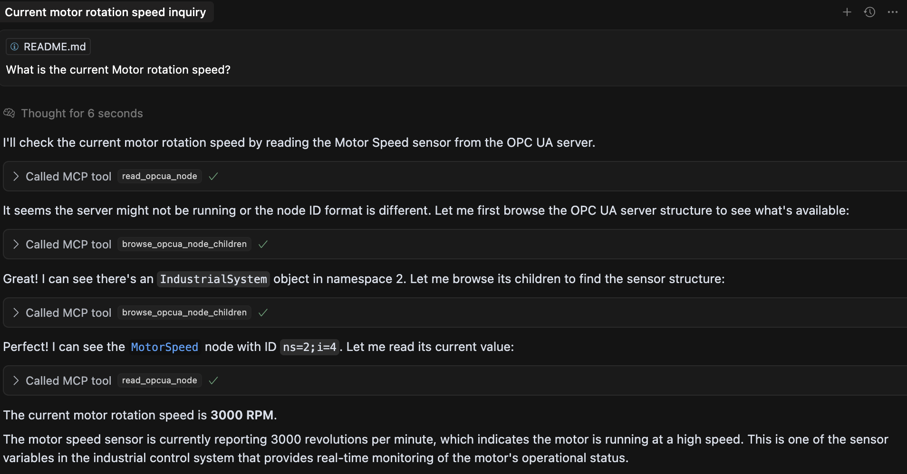
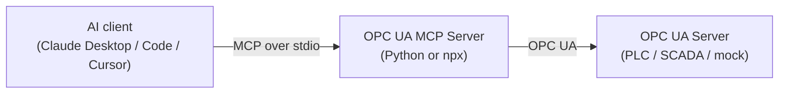

<div align="center">

# 🏭 OPC UA MCP Server

**Read industrial sensors and control equipment on any OPC UA server — through natural language with Claude and any MCP client.**

[](https://www.npmjs.com/package/opcua-mcp-server)
[](https://www.npmjs.com/package/opcua-mcp-server)
[](https://github.com/midhunxavier/OPCUA-MCP/actions/workflows/ci.yml)
[](LICENSE)
[](https://github.com/midhunxavier/OPCUA-MCP)

[](https://www.python.org)
[](https://nodejs.org)
[](https://modelcontextprotocol.io)
[](CONTRIBUTING.md)

[Quick Start](#quick-start) · [Examples](docs/examples.md) · [Testing](docs/testing.md) · [Contributing](CONTRIBUTING.md) · [npm package](https://www.npmjs.com/package/opcua-mcp-server)

</div>



## Overview

Two interchangeable implementations — **Python** and **TypeScript/Node** — expose
the same OPC UA operations as MCP tools. Both connect to any OPC UA server and let
an AI assistant read nodes, write values, browse the address space, call methods,
and read history. Pick whichever runtime fits your stack.



## Quick Start

The fastest path — the npx server, no clone required:

```bash
npx opcua-mcp-server
```

Then point your MCP client at it (see [Configuration](#configuration)):

```json
{
  "mcpServers": {
    "opcua-npx": {
      "command": "npx",
      "args": ["opcua-mcp-server"],
      "env": { "OPCUA_SERVER_URL": "opc.tcp://localhost:4840" }
    }
  }
}
```

Prefer Python, or want the full install matrix? See
[Deployment & Installation](#deployment--installation).


## Example Usage in Conversation

Once configured, you can ask Claude to perform real-world OPC UA operations:

### Reading Sensor Values
- "What is the current temperature reading from the reactor vessel?"
- "Check the pressure level in Tank A"
- "Read all temperature sensors in the cooling system"
- "Get the current flow rate on production line B"

### Controlling Equipment
- "Turn on the conveyor motor"
- "Set the mixer speed to 80 RPM"
- "Open valve V-101 to 75% position"
- "Start the circulation pump"
- "Set the heating element to 150°C"

### Production Operations
- "Start production on line 1 with rate 100 units/hour"
- "Stop all motors in emergency mode"
- "Initialize the batch reactor with recipe A"
- "Begin the cleaning cycle for Tank B"

### System Monitoring
- "Show me all alarm states in the system"
- "Read all sensor values from the water treatment plant"
- "Check the status of all pumps and motors"
- "Get the energy consumption readings"
- "Discover all available variables in the OPC UA server"
- "Show me a complete inventory of all sensors and actuators"

### Real Example Scenarios
```
User: "What's the temperature in reactor R-101?"
Assistant: I'll read the temperature sensor for reactor R-101.
Tool call: read_opcua_node with node_id "ns=2;i=11"
Result: "Reactor R-101 temperature: 87.3°C"

User: "Turn on the main conveyor motor"
Assistant: I'll start the main conveyor motor for you.
Tool call: write_opcua_node with node_id "ns=2;i=12" and value "true"
Result: "Main conveyor motor started successfully"

User: "Set the pump speed to 65%"
Assistant: I'll adjust the pump speed to 65%.
Tool call: write_opcua_node with node_id "ns=2;i=13" and value "65"
Result: "Pump speed set to 65%"

User: "Show me all available variables in the system"
Assistant: I'll get a complete list of all variables in the OPC UA server.
Tool call: get_all_variables
Result: "Found 15 variables:
- Name: Temperature_Sensor_01, NodeID: ns=2;i=101, Value: 87.3°C
- Name: Pressure_Sensor_01, NodeID: ns=2;i=102, Value: 2.5 bar
- Name: Flow_Rate_01, NodeID: ns=2;i=103, Value: 125.8 L/min
..."
```

## Implementation Languages

### Python Version (`opcua-mcp-server`)
- **Language**: Python 3.13+
- **Framework**: FastMCP
- **OPC UA Library**: `opcua` (FreeOpcUa)
- **Transport**: STDIO
- **Entry Point**: `opcua_mcp_server.py` (console script: `opcua-mcp-server`)

### Node Version (`opcua-mcp-server`)
- **Language**: TypeScript/Node.js
- **Framework**: @modelcontextprotocol/sdk
- **OPC UA Library**: `node-opcua`
- **Transport**: STDIO
- **Entry Point**: `src/index.ts` (compiled to `build/index.js`)

## Tools

Both servers expose the same MCP tools — read / write / browse nodes, batch read & write, call methods, list all variables, plus capability-gated history and aggregate reads. The full per-tool reference (inputs, outputs, and a node-ID map) is in **[docs/examples.md](docs/examples.md)**, and the tool surface is defined once in [`contract/tools.json`](contract/tools.json) (both servers derive from it).

## Deployment & Installation

### Python Version
```bash
# Install the Python workspace (from the repo root)
uv sync --all-packages

# Run the Python server
uv run --no-sync opcua-mcp-server
```

### NPX Version
```bash
# Direct usage (recommended)
npx opcua-mcp-server

# Global installation
npm install -g opcua-mcp-server
opcua-mcp-server

# Development
npm install
npm run build
npm start
```

**NPM Package**: https://www.npmjs.com/package/opcua-mcp-server

## Configuration

Both versions use the same environment variable:
- `OPCUA_SERVER_URL`: OPC UA server endpoint (default: `opc.tcp://localhost:4840`)

### Python Configuration Example
```json
{
  "mcpServers": {
    "opcua-python": {
      "command": "/Users/mx/.local/bin/uv",
      "args": [
        "--directory",
        "/path/to/packages/server-python",
        "run",
        "opcua-mcp-server"
      ],
      "env": {
        "OPCUA_SERVER_URL": "opc.tcp://localhost:4840"
      }
    }
  }
}
```

### NPX Configuration Example
```json
{
  "mcpServers": {
    "opcua-npx": {
      "command": "npx",
      "args": ["opcua-mcp-server"],
      "env": {
        "OPCUA_SERVER_URL": "opc.tcp://localhost:4840"
      }
    }
  }
}
```

## Dependencies

### Python Version
- `mcp[cli]>=1.9.1`: MCP framework
- `opcua>=0.98.13`: OPC UA client library
- `cryptography>=45.0.2`: Security support
- `httpx>=0.28.1`: HTTP client

### NPX Version
- `@modelcontextprotocol/sdk`: MCP SDK for Node.js
- `node-opcua`: Comprehensive OPC UA library
- `typescript`: TypeScript compiler
- `@types/node`: Node.js type definitions


## Testing

There are three ways to exercise the servers — the automated suite, the MCP
Inspector (UI or CLI), and an AI agent (Claude Code / Desktop / Cursor). Start the
mock server first, then:

```bash
uv sync --all-packages              # one-time, from the repo root
cd tests && uv run --no-sync pytest -v    # end-to-end suite, both servers
```

See **[docs/testing.md](docs/testing.md)** for the full guide (Inspector walkthrough, AI-agent
setup, example prompts, troubleshooting) and **[docs/examples.md](docs/examples.md)** for
per-tool inputs/outputs and a node-ID reference.

## Contributing

Contributions are welcome — see **[CONTRIBUTING.md](CONTRIBUTING.md)** for project
layout, local development, adding a new tool to both servers, and PR conventions.


## Security

Both versions currently connect with:
- `SecurityPolicy.None`
- `MessageSecurityMode.None`

For production use, both should implement:
- Certificate-based authentication
- Encrypted communication
- User authentication
- Input validation

